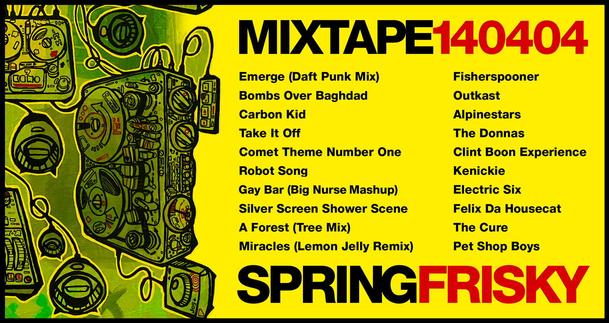

Hello, Mixtapes have been found from the early 2000s.

MIXTAPE140404 / SPRINGFRISKY
---

<link rel="stylesheet" href="mixtapes.css">

<table class="mixtape-table">
	<tr>
		<td>Emerge (Daft Punk Mix)</td>
		<td>Fischerspooner</td>
	</tr>
	<tr>
		<td>Bombs Over Baghdad</td>
		<td>Outkast</td>
	</tr>
	<tr>
		<td>Carbon Kid</td>
		<td>Alpinestars</td>
	</tr>
	<tr>
		<td>Take It Off</td>
		<td>The Donnas</td>
	</tr>
	<tr>
		<td>Comet Theme Number One</td>
		<td>Clint Boon Experience</td>
	</tr>
	<tr>
		<td>Robot Song</td>
		<td>Kenickie</td>
	</tr>
	<tr>
		<td>Gay Bar (Big Nurse Mashup)</td>
		<td>Electric Six</td>
	</tr>
	<tr>
		<td>Silver Screen Shower Scene</td>
		<td>Felix Da Housecat</td>
	</tr>
	<tr>
		<td>A Forest (Tree Mix)</td>
		<td>The Cure</td>
	</tr>
	<tr>
		<td>Miracles (Lemon Jelly Remix)</td>
		<td>Pet Shop Boys</td>
	</tr>
</table>

	<iframe width="100%" height="600" scrolling="no" frameborder="no" allow="autoplay" src="https://w.soundcloud.com/player/?url=https%3A//api.soundcloud.com/tracks/1318625044&color=%23ff5500&auto_play=true&hide_related=false&show_comments=true&show_user=true&show_reposts=false&show_teaser=true&visual=true"></iframe>
<a href="https://soundcloud.com/user-183763546" title="paulpod" target="_blank" style="color: #cccccc; text-decoration: none;">paulpod</a> · <a href="https://soundcloud.com/user-183763546/neuromantics-mixtape-140404-springfrisky" title="Neuromantics - Mixtape - 140404 - Springfrisky" target="_blank" style="color: #cccccc; text-decoration: none;">Neuromantics - Mixtape - 140404 - Springfrisky</a>



Download full mix 45:38 [AAC M4A file](neuromantics-mixtape-140404-springfrisky.m4a)

Not quite the mixes & versions [Spotify playlist](https://open.spotify.com/playlist/7aUEU6EGzZ7109mxcwsvIb?si=930ca6ff43dc4f56)
